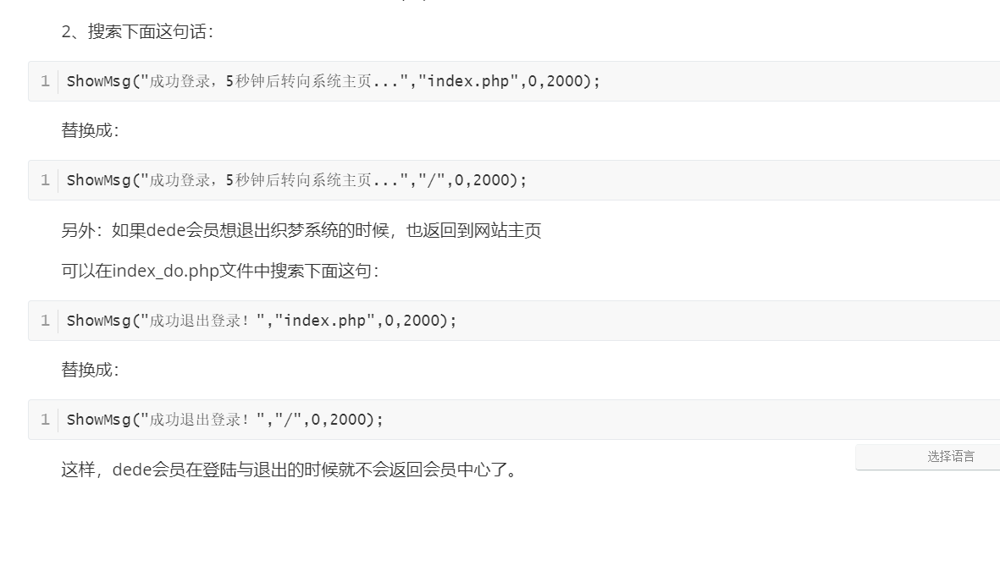

## 会员登陆后在网站前台显示登录名

再head.htm模板里面增加如下代码：

```php+HTML
<head>
  <script language="javascript" src="/include/dedeajax2.js"></script>
  <script language="javascript" type="text/javascript"> 
      function CheckLogin(){
      var taget_obj = document.getElementById('_userlogin');/*这里的名字一定要和调用的页面使用的ID值一致*/
      myajax = new DedeAjax(taget_obj,false,false,'','','');
      myajax.SendGet2("/member/ajax_loginsta.php");/*可以复制上面的loginsta 在php页面填写需要的信息 最后记住一定要改名字哦。具体操作看第二步*/
      DedeXHTTP = null;
    }
</script>
</head>
```

再在注册登录的位置套一个div，其id取名为“__userlogin”，与上一步的“document.getElementById('_')”保持一致，最后加上

```html
 <script language="javascript" type="text/javascript">CheckLogin();</script>/*函数名与head里面保持一致*/
```


现在设置/member/ajax_loginsta.php文件，这个文件是用来显示会员登录后，要在首页调用的信息，可选择性的删掉信息

```
<div class="mylink">
   <ul>
           <li><a href="">会员中心</a></li>
           <li><a href="">我的收藏</a></li>
           <li><a href="">发表文章</a></li>
           <li><a href="">好友管理</a></li>
           <li><a href="">访客记录</a></li>
           <li><a href="">查找好友</a></li>
           <li><a href="">退出登录</a> </li>
     </ul>
   </div>
```

根据实际情况请自行修改，一定要重新编写css样式，如果要设置成鼠标划过，显示信息则需要设置css样式z-index=N，N的数值越大越好。


### dede:arclist与dede:list的区别是dede:arclist无分页功能

1、引入js部分，而且要确保这2个文件存在 /include/dedeajax2.js 和 /plus/arcmulti.php

在对应的模板页面加入以下代码：

```php
<script type="text/javascript" src="{dede:global.cfg_cmspath/}/include/dedeajax2.js"></script>
<script type="text/javascript">
function multi(pagenum,tagid)
{
var taget_obj = document.getElementById(tagid);
var taget_obj_page = document.getElementById("page_"+tagid);
myajax = new DedeAjax(taget_obj,false,false,'','','');
myajax.SendGet2("{dede:global.cfg_cmspath/}/plus/arcmulti.php?mtype=0&pnum="+pagenum+'&tagid='+tagid);
myajax = new DedeAjax(taget_obj_page,false,false,'','','');
myajax.SendGet2("{dede:global.cfg_cmspath/}/plus/arcmulti.php?mtype=1&pnum="+pagenum+'&tagid='+tagid);
DedeXHTTP = null;
}
</script>
```

2、数据列表标签 和 分页标签

```php
<ul class="productul">
     {dede:arclist pagesize ='5' addfields='fw_mingchen,fw_quyu,fw_shoufei' channelid='1' tagid='index'}
      <li style="width: 100%;">
        <a href="[field:arcurl/]" title="[field:title/]">
            
        </a>
      </li>
      {/dede:arclist}
</ul>
    <!--分页样式--> 
    <div class="page"> {dede:arcpagelist tagid='index'/}</div> 
```


```
{dede:arclist titlelen='250' pagesize='5' tagid='myindex'}
{dede:arcpagelist tagid='myindex'/}
```

标色地方是必须要的，而且tagid要统一，效果：


3.做翻页样式：找到文件\include\taglib\arcpagelist.lib.php，找到方法function multipage 翻页样式在这里修改
以下是做好的一断代码可以直接复制：

```
function multipage($allItemTotal, $currPageNum, $pageSize, $tagid='')
{
    if ($allItemTotal == 0) return "";

    //计算总页数
    $pagesNum = ceil($allItemTotal/$pageSize);

    //第一页显示
    $firstPage = ($currPageNum <= 1) ? "<span>[首页]</span>" : "<a href='javascript:multi(1,\"{$tagid}\")' title='第1页'><span>[首页]</span></a>";

    //最后一页显示
    $lastPage = ($currPageNum >= $pagesNum)? "<span>[尾页]</span>". $currPageNum : "<a href='javascript:multi(". $pagesNum . ",\"{$tagid}\")' title='第". $pagesNum ."页'><span>[尾页]</span></a>";

    //上一页显示
    $prePage  = ($currPageNum <= 1) ? "<span>[上一页]</span>" : "<a href='javascript:multi(". ($currPageNum-1) . ",\"{$tagid}\")'  accesskey='p'  title='上一页'><span>[上一页]</span></a>";

    //下一页显示
    $nextPage = ($currPageNum >= $pagesNum) ? "<span>[下一页]</span>" : "<a href='javascript:multi(". ($currPageNum+1) .",\"{$tagid}\")' title='下一页'><span>[下一页]</span></a>";

    //共X页 共X条记录
    $pagesNum2 = "&nbsp;&nbsp;共&nbsp;".$pagesNum."&nbsp;页&nbsp;&nbsp;共&nbsp;".$allItemTotal."&nbsp;条记录";

    //按页显示
    $listNums = "";
    $listNums.= $firstPage;
    $listNums.= $prePage;
    for ($i=($currPageNum-4); $i<($currPageNum+9); $i++) {
        if ($i < 1 || $i > $pagesNum) continue;
        if ($i == $currPageNum)
        {
            $listNums.= "<a href='javascript:void(0)' class='thislink'><span>".$i."</span></a>";
        }else 
        {
            $listNums.= " <a href='javascript:multi(". $i .",\"{$tagid}\")' title='". $i ."'><span>". $i ."</span></a> ";
        }
    }
    $listNums.= $nextPage;
    $listNums.= $lastPage;
    $listNums.= $pagesNum2;

    $returnUrl = $listNums;
    return $returnUrl;
}
```

3、做CSS分页样式：在模板头文件head中间加入如下代码：

```
<style>
* {
    padding: 0;
    margin: 0;
}
/*
  * 外面盒子样式---自己定义
  */

.page_div {
    font-size: 12px;
    font-family: "microsoft yahei";
    color: #666666;
    margin-right: 10px;
    padding-left: 42px;
    box-sizing: border-box;
}
/*
 * 页数按钮样式
 */

.page_div span {
    min-width: 30px;
    height: 28px;
    border: 1px solid #dce0e0!important;
    text-align: center;
    margin: 0 4px;
    cursor: pointer;
    line-height: 28px;
    color: #666666;
    font-size: 13px;
    display: inline-block;
}
</style>
```

4.调用CSS样式：

```
<div class="page_div" align="center">
    {dede:arcpagelist tagid='index'/}
</div>
```


### dede:arclist分页存在其他的BUG修复方案

1、修正数据库字段类型长度问题，不然{dede:arclist}中间部分代码过长会被截断{/dede:arclist}
UTF-8的[织梦](https://so.csdn.net/so/search?q=织梦&spm=1001.2101.3001.7020)程序在后台-系统-SQL命令行工具，执行

```sql
ALTER TABLE `dede_arcmulti` CHANGE `innertext` `innertext` TEXT CHARACTER SET utf8 COLLATE utf8_general_ci NOT NULL DEFAULT '';
```

GBK的织梦程序在后台-系统-SQL命令行工具，执行

```sql
ALTER TABLE `dede_arcmulti` CHANGE `innertext` `innertext` TEXT CHARACTER SET gbk COLLATE gbk_chinese_ci NOT NULL DEFAULT '';
```

**2、修复只能获取10条数据问题**
打开 /include/taglib/arclist.lib.php 找到

```php
$idsstr = join(',', $ids);
```

在它下面加入

```php
//arclist分页BUG修复
$query = "SELECT arc.*,tp.typedir,tp.typename,tp.corank,tp.isdefault,tp.defaultname,tp.namerule,
tp.namerule2,tp.ispart,tp.moresite,tp.siteurl,tp.sitepath
$addfieldsSql
FROM `$maintable` arc LEFT JOIN `dede_arctype` tp on arc.typeid=tp.id
$addfieldsSqlJoin
$orwhere $ordersql";
$dsql->SetQuery($query);
$dsql->Execute('tag'); 
while($row = $dsql->GetArray('tag')) {
$tagids[] = $row['id'];
}
$idsstr = join(',', $tagids);
//arclist分页BUG修复
```

最后还需要在后台-系统-SQL命令行工具，执行

```sql
TRUNCATE `dede_arcmulti`;
```

结果


**3、点击分页码，跳转是发现页面样式全部歪了，而且循环列表代码始终不正确，对比发现缺失很大一部分代码，最后分析发现织梦数据库dede_arcmulti表，innertext字段一varchar形式定义，字数超过限制,最终改掉该字段数据类型为text，然后更新网站，样式正常！！（以上博文参考过https://blog.csdn.net/moshihahamowang/article/details/17915465）** 


### 会员退出登陆后回到网站主页

织梦会员前台登录后,默认会跳转到会员中心，如果我们想登陆后，跳转到网站主页，那么就请参考下面的方法实现织梦DeDeCms会员登录或退出跳转到首页。

1、在根目录的member目录中找到index_do.php这个文件

2、搜索下面这句话：

```
ShowMsg("成功登录，5秒钟后转向系统主页...","index.php",0,2000);  
```

替换成：

```
ShowMsg("成功登录，5秒钟后转向系统主页...","/",0,2000);  
```

另外：如果dede会员想退出织梦系统的时候，也返回到网站主页

可以在index_do.php文件中搜索下面这句：

```
ShowMsg("成功退出登录！","index.php",0,2000);  
```

替换成：

```
ShowMsg("成功退出登录！","/",0,2000);  
```

这样，dede会员在登陆与退出的时候就不会返回会员中心了。

